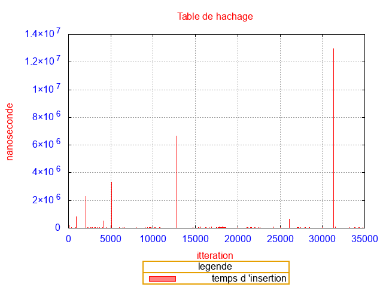
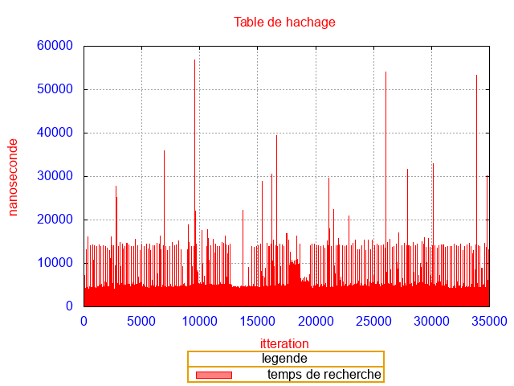
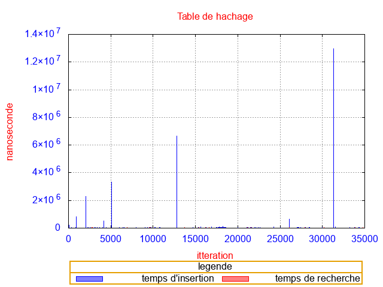
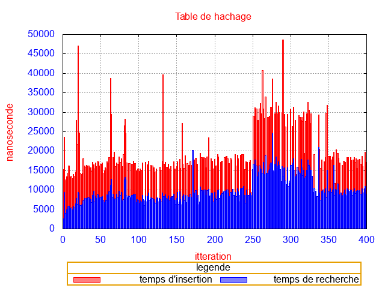

# Analyse des graphiques

Les graphiques analysés ont été faits sur gnuplot 
# Analyse des graphiques unordered_map
## Analyse de l'insertion

  
Ce graphique met en évidence le fait que unordered_map double la taille de la table de hachage quand on a atteint la taille limite. Chaque pique dans l'insertion est un moment où unordered_map double la taille du tableau. Donc vu que la table de hachage double le temps d'insertion elle double aussi à chaque fois que le tableau double de taille. Donc en dehors des piques l'insertion d'un élement correspond à O(1)

## Analyse de la recherche
  
On remarque aussi que la recherche d'un élément répond à une courbe O(1) les piques sont justes des temps longs dû au hasard. (si on faisait une moyenne des temps la courbe serait bien plane)

## Graphique d'insertion et de la recherche
  

# Analyse des graphiques de map

Les graphiques analysés ont été fait sur gnuplot 

## Analyse de l'insertion

  
On peut remarqer sur le graphique que entre les valeurs 0 aà 100 il y a une montée puis ensuite une stabilisation. Ce graphique corespond donc à une courbe O(log(n)). map a donc pour insertion et recherche un log(n).